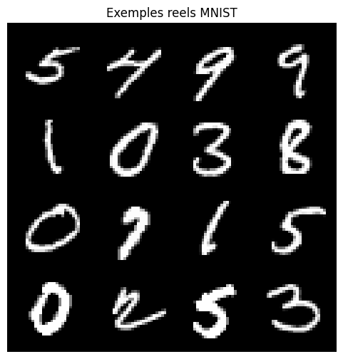
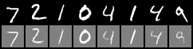
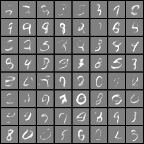
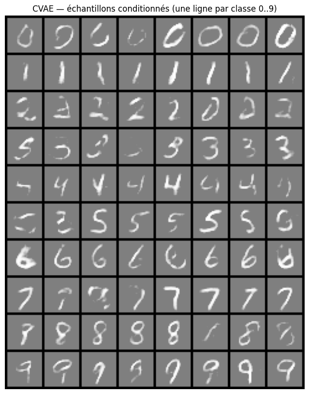
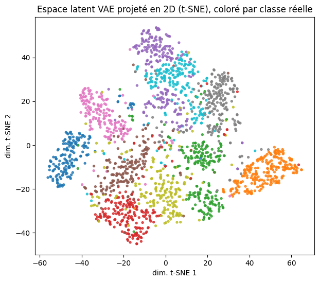
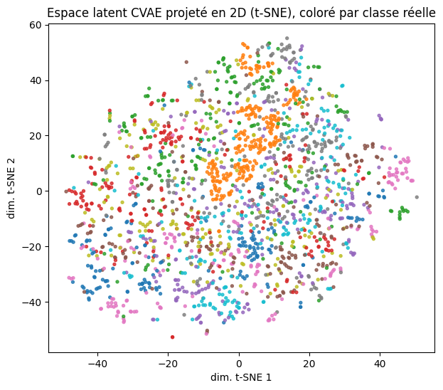
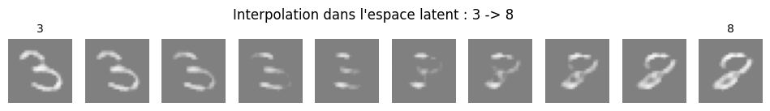
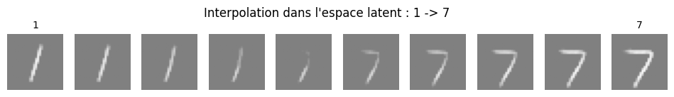

# VAE / CVAE pour la génération d'images

Implémentation en PyTorch d'un **Variational Autoencoder (VAE)** et de sa variante conditionnelle, le **CVAE**, appliqués à la génération et à la reconstruction d'images de chiffres manuscrits (MNIST). Le projet inclut l'entraînement, une étude d'ablation sur l'hyperparamètre β, la visualisation de l'espace latent, une interpolation latente, une comparaison quantitative entre les deux modèles, et un suivi des expériences avec MLflow.

Ce document décrit le projet de bout en bout : le sujet traité, la démarche suivie, la manière d'exécuter le code, et les résultats obtenus.

## Sommaire

1. [Contexte et objectifs](#1-contexte-et-objectifs)
2. [Résumé des résultats](#2-résumé-des-résultats)
3. [Installation et prise en main](#3-installation-et-prise-en-main)
4. [Structure du dépôt](#4-structure-du-dépôt)
5. [Approche technique](#5-approche-technique)
6. [Protocole expérimental](#6-protocole-expérimental)
7. [Résultats détaillés](#7-résultats-détaillés)
8. [Suivi des expériences avec MLflow](#8-suivi-des-expériences-avec-mlflow)
9. [Déploiement du modèle (API pour l'application web)](#9-déploiement-du-modèle-api-pour-lapplication-web)
10. [Limites connues et travaux futurs](#10-limites-connues-et-travaux-futurs)
11. [Difficultés techniques rencontrées](#11-difficultés-techniques-rencontrées)
12. [Organisation de l'équipe](#12-organisation-de-léquipe)
13. [Glossaire](#13-glossaire)
14. [Commandes de référence](#14-commandes-de-référence)
15. [Documents complémentaires](#15-documents-complémentaires)

---

## 1. Contexte et objectifs

Ce projet répond à un sujet académique intitulé **"VAE conditionnel pour la génération d'images"**, dont l'objectif est d'implémenter un autoencodeur variationnel (VAE) et sa variante conditionnelle (CVAE), puis de comparer leur capacité à générer des images, avec ou sans contrôle sur la classe produite.

Références du sujet :
- Kingma & Welling, *Auto-Encoding Variational Bayes* (2013) — [arxiv.org/abs/1312.6114](https://arxiv.org/abs/1312.6114)
- Sohn et al., *Learning Structured Output Representation using Deep Conditional Generative Models* (2015) — [NeurIPS](https://proceedings.neurips.cc/paper/2015/hash/8d55a249e6baa5c06772297520da2051-Abstract.html)

**Exigences du sujet :**
- Implémenter le VAE (encodeur, reparamétrisation, décodeur, loss ELBO = reconstruction + KL).
- Implémenter le CVAE (label injecté à l'encodeur et au décodeur).
- Mener une étude d'ablation sur l'effet du poids du terme KL (β) sur la qualité de reconstruction vs. la structure de l'espace latent.
- Visualiser l'espace latent (projection 2D) et l'interpolation entre deux exemples.
- Évaluer quantitativement la qualité de génération.
- Le sujet prévoit trois jeux de données : **MNIST**, **Fashion-MNIST**, **CelebA**.

**Périmètre couvert par ce dépôt à ce jour :** l'ensemble des exigences ci-dessus a été traité sur **MNIST**, y compris le déploiement du modèle comme service HTTP consommable par une application web (demandé en cours de projet, voir [section 9](#9-déploiement-du-modèle-api-pour-lapplication-web)). Fashion-MNIST et CelebA ne sont pas encore implémentés (voir [section 10](#10-limites-connues-et-travaux-futurs)).

## 2. Résumé des résultats

Pour un lecteur pressé, voici l'essentiel :

- Un VAE et un CVAE ont été entraînés sur les 70 000 images de MNIST (54 000 train / 6 000 validation / 10 000 test).
- Le CVAE génère correctement la classe demandée dans la grande majorité des cas (`reports/figures/cvae_grid.png`).
- L'étude d'ablation sur β (valeurs 0.1, 1.0, 5.0), **validée statistiquement sur 3 seeds par valeur**, montre que **β = 1.0 est le meilleur compromis** : β trop faible régularise mal l'espace latent, β trop élevé provoque un effondrement de l'espace latent (*posterior collapse*), visible aussi bien dans les métriques que dans les images générées.
- Fait notable : le VAE, bien qu'il ne reçoive jamais l'information de classe, structure spontanément son espace latent par chiffre (visible en projection t-SNE) ; le CVAE, lui, ne le fait pas, car cette information lui est donnée directement.
- Les modèles principaux et l'étude d'ablation ont été revalidés avec plusieurs seeds pour garantir que les résultats sont reproductibles et non liés au hasard de l'initialisation.
- L'ensemble des entraînements (15 au total) est suivi et consultable via **MLflow**.
- Le CVAE est déployé comme un service HTTP via le Model Registry MLflow, prêt à être consommé par l'application web de démonstration (voir [section 9](#9-déploiement-du-modèle-api-pour-lapplication-web)).

Le détail de chaque résultat, avec les fichiers exacts à consulter, est donné en [section 7](#7-résultats-détaillés).

## 3. Installation et prise en main

### Prérequis
- Python 3.11
- Pas de GPU requis (le projet a été développé et testé entièrement sur CPU)

### Installation

```bash
python -m venv .venv
source .venv/Scripts/activate      # Windows PowerShell : .venv\Scripts\Activate.ps1
python -m pip install -r requirements.txt
```

Dépendances principales : `torch`, `torchvision`, `numpy`, `matplotlib`, `pyyaml`, `scikit-learn`, `mlflow`, `pytest`.

### Vérification de l'installation

```bash
python -m pytest -q
```

Le dépôt contient 8 tests unitaires couvrant les formes des modèles, la loss ELBO, le chargement des données et une itération d'entraînement.

### Test rapide (sans attendre un entraînement complet)

```bash
python -m src.training.train --config configs/mnist_vae.yaml --smoke-test
```

## 4. Structure du dépôt

```
configs/                       fichiers de configuration YAML
  mnist_vae.yaml                 VAE principal
  mnist_cvae.yaml                 CVAE principal
  ablation_beta.yaml               étude d'ablation sur beta

src/
  data/datasets.py                chargement de MNIST, points d'extension Fashion-MNIST/CelebA
  models/vae.py                    modèle VAE
  models/cvae.py                   modèle CVAE (conditionnement one-hot ou multi-label)
  models/layers.py                 blocs convolutifs partagés
  losses/elbo.py                   loss ELBO = reconstruction + beta * KL
  training/trainer.py              boucle d'entraînement, validation, checkpoint, logs, MLflow
  training/train.py                point d'entrée CLI
  visualization/latent.py          projection t-SNE de l'espace latent
  visualization/interpolation.py   interpolation entre deux images dans l'espace latent
  evaluation/                      réservé aux futures métriques (FID, etc.)
  serving/generation_pyfunc.py     wrapper MLflow pyfunc : generate (CVAE) + interpolate (VAE)

scripts/
  run_ablation.py                  étude d'ablation sur beta (1 seed)
  run_ablation_seed_worker.py      un run d'ablation pour un couple (beta, seed) donné
  aggregate_ablation_seeds.py      agrège les runs multi-seed de l'ablation
  run_main_seed_worker.py          un run des modèles principaux pour un seed donné
  backfill_mlflow.py               réimporte dans MLflow des runs déjà exécutés
  compute_latent_centroids.py      précalcule un point latent par classe (prérequis interpolation)
  register_generation_model.py     enregistre generate (CVAE) + interpolate (VAE) dans MLflow (déploiement)
  generate_cvae_grid.py            grille d'échantillons conditionnés par classe
  generate_vae_recon_grid.py       grille de reconstruction + grille d'échantillons libres
  evaluate.py                      comparaison quantitative VAE vs CVAE
  inspect_dataloader.py            vérification visuelle du chargement des données

reports/
  experiments/
    vae_main/, cvae_main/            modèles principaux (10 epochs, données complètes)
    ablation/beta_0.1/, beta_1.0/, beta_5.0/     ablation, 1 seed
    ablation_seeds/beta_<b>_seed_<s>/            ablation, 3 seeds x 3 betas
    vae_seeds/seed_<s>/, cvae_seeds/seed_<s>/    modèles principaux, 3 seeds
    ablation/results.json, comparison.json       résultats bruts
  figures/                           toutes les figures produites (détail en section 7)

docs/
  RESULTATS.md                     tableaux de résultats générés automatiquement par les scripts
  explanations.md                  documentation technique complémentaire (concepts, FAQ)
  presentation_groupe.md           script de présentation orale du projet
  DEPLOIEMENT.md                   contrat d'API du service de génération, pour l'équipe web

mlflow.db                        base SQLite contenant l'historique des runs MLflow
tests/                           suite de tests unitaires
```

## 5. Approche technique

### 5.1 Le VAE

Une image passe dans un **encodeur** convolutif qui produit deux vecteurs, `mu` et `logvar` : la moyenne et la log-variance d'une distribution gaussienne. Un point `z` est tiré dans cette distribution via la **reparamétrisation** `z = mu + eps * exp(0.5 * logvar)` (avec `eps` aléatoire), une astuce qui permet de rétropropager le gradient malgré le tirage aléatoire. Un **décodeur** convolutif reconstruit ensuite une image à partir de `z`.

### 5.2 Le CVAE

Même architecture, avec le label de classe (encodé en one-hot) ajouté :
- en entrée de l'encodeur, sous forme de canaux supplémentaires concaténés à l'image ;
- en entrée du décodeur, concaténé au vecteur latent `z`.

Le décodeur reçoit donc systématiquement deux informations : la forme encodée dans l'espace latent, et la classe demandée. L'implémentation (`src/models/cvae.py`) est générique et supporte aussi bien un conditionnement `one_hot` (une classe active) qu'un conditionnement `multi_label` (plusieurs attributs actifs, utile pour un futur passage à CelebA).

### 5.3 La fonction de perte (ELBO)

```
loss = reconstruction + beta * KL
```

- **reconstruction** : erreur quadratique moyenne (MSE) entre l'image d'entrée et l'image reconstruite.
- **KL** : divergence de Kullback-Leibler entre la distribution latente apprise `q(z|x)` et une gaussienne standard `N(0, I)` (le prior). Elle force l'espace latent à rester régulier, condition nécessaire pour pouvoir ensuite générer de nouvelles images en tirant `z` au hasard dans le prior.
- **beta** : coefficient de pondération du terme KL. C'est le paramètre étudié dans l'ablation ([section 7.4](#74-étude-dablation-sur-β)).

### 5.4 Choix d'architecture et d'hyperparamètres

| Paramètre | Valeur | Justification |
|---|---|---|
| `latent_dim` | 16 | Suffisant pour capturer la variabilité des 10 classes de MNIST tout en forçant une réelle compression. |
| `hidden_channels` | 32 | Largeur de couche standard pour un problème aussi simple que MNIST (28×28, niveaux de gris), permet de rester rapide à entraîner sur CPU. |
| `batch_size` | 128 | Valeur courante équilibrant vitesse et stabilité de l'optimisation. |
| `lr` (Adam) | 0.001 | Valeur par défaut usuelle pour Adam, converge de façon fiable sans réglage fin nécessaire sur ce problème. |
| `beta` | 1.0 | Retenu après étude d'ablation, voir section 7.4. |
| `epochs` (modèles principaux) | 10 | Choisi après observation de la courbe de perte, qui se stabilise à partir de l'epoch 7-8 ; validé a posteriori par un ré-entraînement à 20 epochs (section 7.6) montrant un gain marginal. |

## 6. Protocole expérimental

Trois familles d'expériences ont été menées, toutes sur MNIST (torchvision, transformation `Normalize((0.5,), (0.5,))`, split 90/10 du train set officiel pour train/val, test set officiel séparé) :

1. **Modèles principaux** (`vae_main`, `cvae_main`) : un VAE et un CVAE entraînés sur les données complètes (54 000 images), 10 epochs, β=1.0, seed=42. Ce sont les modèles utilisés pour produire les figures de reconstruction, de génération et de visualisation de l'espace latent.
2. **Étude d'ablation sur β** : le même VAE entraîné avec β ∈ {0.1, 1.0, 5.0}, sur un sous-ensemble de 12 000 images d'entraînement (le jeu de validation reste complet) pour limiter le temps de calcul sur CPU. Chaque valeur de β a été testée avec 3 seeds différents (0, 42, 123) sur 20 epochs, afin de vérifier que les écarts observés sont bien dus à β et non au hasard de l'initialisation.
3. **Validation multi-seed des modèles principaux** : `vae_main` et `cvae_main` ont été réentraînés chacun avec 3 seeds (0, 42, 123), sur les données complètes, à 20 epochs, pour confirmer que leurs résultats sont reproductibles.

Toutes les expériences sont reproductibles : la graine aléatoire (seed) fixe l'initialisation des poids et l'ordre des mini-lots (`src/utils/seed.py`), et chaque expérience écrit ses résultats dans un dossier de sortie dédié (`reports/experiments/<nom>/`) pour éviter toute collision entre runs.

## 7. Résultats détaillés

### 7.1 Reconstruction et génération

**16 images réelles de MNIST**, servant de référence visuelle :



**Reconstruction par le VAE** (haut : images réelles ; bas : leur reconstruction) :



Une bonne correspondance entre les deux lignes indique que l'encodeur/décodeur a bien appris. Un léger flou est un effet normal de la loss MSE + KL, pas une anomalie.

**Génération libre du VAE** — 64 images générées en tirant `z ~ N(0, I)`, sans condition (la classe produite n'est pas contrôlable) :



**Génération conditionnée par le CVAE** — une ligne par classe (0 à 9), chaque ligne générée en demandant explicitement cette classe :



Figure clé pour juger la contrôlabilité : chaque ligne doit ressembler au chiffre demandé. Les classes 0, 1, 2, 7, 8, 9 sont nettes et cohérentes ; certaines lignes (3, 4, 5, 6) contiennent des échantillons plus ambigus, cohérent avec un entraînement de 10 epochs sur CPU.

### 7.2 Espace latent

Projection t-SNE en 2D de 2000 images de test dans l'espace latent, colorées par classe réelle :

**VAE :**



**CVAE :**



**Observation principale :** dans le VAE, les points se regroupent nettement par classe **bien que le label ne soit jamais fourni au modèle** — le réseau apprend spontanément à séparer les chiffres dans l'espace latent, cette organisation étant la stratégie la plus efficace pour bien reconstruire des images très différentes. Dans le CVAE, les classes restent mélangées dans l'espace latent : cohérent, puisque l'information de classe est déjà fournie séparément au décodeur, l'espace latent se spécialise alors sur autre chose (le style d'écriture : inclinaison, épaisseur du trait...).

### 7.3 Interpolation latente

Interpolation linéaire, en 10 étapes, entre le `z` de deux vrais exemples :

**De 3 à 8 :**



**De 1 à 7 :**



La transition entre les deux classes est progressive, sans saut brutal, ce qui indique que l'espace latent appris est continu — propriété directement liée à la régularisation par le terme KL.

### 7.4 Étude d'ablation sur β

**Résultat consolidé (3 betas × 3 seeds, 20 epochs, sous-ensemble de 12 000 images) :**

| β | Reconstruction (moyenne ± écart-type) | KL (moyenne ± écart-type) |
|---|---|---|
| 0.1 | 672.33 ± 0.24 | 40.75 ± 0.81 |
| 1.0 | 682.98 ± 0.14 | 16.62 ± 0.08 |
| 5.0 | 724.77 ± 0.26 | 0.21 ± 0.06 |

Figures : `reports/figures/ablation_beta_seeds_curve.png` (courbe avec barres d'erreur) et `reports/figures/ablation_beta_reconstruction_comparison.png` (comparaison visuelle des reconstructions selon β).

**Interprétation :**
- L'écart-type entre seeds, pour une même valeur de β, est très faible (moins d'1 point) comparé à l'écart entre les valeurs de β (plus de 50 points entre β=0.1 et β=5.0). Les effets observés sont donc attribuables à β, pas au hasard de l'initialisation.
- **β = 0.1** : meilleure reconstruction, mais KL très élevé (40.75) : l'espace latent est peu régularisé, ce qui dégrade la fiabilité de la génération à partir d'un `z` aléatoire.
- **β = 5.0** : KL quasi nul (0.21), symptôme de *posterior collapse* — le décodeur cesse d'utiliser l'espace latent. Visible directement sur `ablation_beta_reconstruction_comparison.png` : les reconstructions deviennent des taches informes, indépendamment de l'image d'entrée.
- **β = 1.0** : meilleur compromis entre fidélité de reconstruction et régularité de l'espace latent. C'est la valeur retenue pour les modèles principaux.

Une première passe à 1 seul seed et 6 epochs avait déjà montré la même tendance (table dans `docs/RESULTATS.md`) ; la version multi-seed ne fait que la confirmer avec plus de rigueur statistique.

### 7.5 Comparaison quantitative VAE vs CVAE

Mesuré sur les 10 000 images du test set MNIST (modèles principaux) :

| Critère | VAE | CVAE |
|---|---|---|
| Contrôle de la classe générée | Non — la classe produite n'est pas choisissable | Oui — argument explicite de `sample()` |
| Couverture des classes en génération libre | Inégale : 4 classes sur 10 observées sur 1000 tirages sans condition | Non applicable, la classe est toujours choisie |
| Organisation de l'espace latent | Se structure spontanément par classe | Reste mélangé par classe, se spécialise sur le style |
| Reconstruction (test set) | 677.35 | 676.56 |
| KL (test set) | 17.12 | 13.89 |

**Conclusion :** le CVAE ne reconstruit pas mieux que le VAE (ce n'est pas son objectif), mais résout le problème d'absence de contrôle du VAE classique en déplaçant l'information de classe hors de l'espace latent.

**Mesure de contrôlabilité du CVAE.** Une mesure automatique a été mise en place pour quantifier la contrôlabilité au-delà de l'inspection visuelle : un classifieur "plus proche centroïde" (chaque classe est représentée par l'image moyenne des vrais chiffres de cette classe en pixels). Résultat obtenu sur les échantillons générés par le CVAE : **29,4 % de précision globale**, très inférieur à ce que suggère l'inspection visuelle de `cvae_grid.png`. Vérification effectuée sur de vraies images de test (non générées) : le même classifieur atteint 82 % de précision, ce qui valide la méthode en soi. L'écart s'explique par la sensibilité de cette méthode de distance en pixels au **flou** des images générées par un VAE — en particulier pour les chiffres à trait fin (1, 4, 7, 9), un léger flou les rapproche en distance de pixels de classes visuellement plus "pleines" (0, 8), alors qu'un humain les identifie sans ambiguïté. **Ce proxy quantitatif sous-estime donc la contrôlabilité réelle du CVAE** ; à ce stade, l'inspection visuelle reste la mesure la plus fiable. Un classifieur CNN dédié donnerait une mesure plus juste (voir [section 9](#9-limites-connues-et-travaux-futurs)).

### 7.6 Validation multi-seed des modèles principaux

`vae_main` et `cvae_main` ont été réentraînés chacun avec 3 seeds (0, 42, 123), sur les données complètes, à 20 epochs (contre 10 initialement) :

| Modèle | Reconstruction (moyenne ± écart-type) | KL (moyenne ± écart-type) |
|---|---|---|
| VAE | 677.08 ± 0.18 | 17.25 ± 0.17 |
| CVAE | 675.75 ± 0.88 | 14.14 ± 0.46 |

Le VAE est très stable d'un seed à l'autre ; le CVAE varie légèrement plus (écart-type environ 5× supérieur), cohérent avec la tâche légèrement plus complexe qu'il doit apprendre (combiner image et condition), mais l'écart reste faible comparé à l'effet de β. Passer de 10 à 20 epochs n'apporte qu'un gain marginal pour les deux modèles, confirmant que 10 epochs suffisait déjà. Les figures présentées dans ce document restent basées sur les checkpoints `vae_main`/`cvae_main` d'origine (10 epochs, seed=42) ; cette validation multi-seed confirme uniquement leur caractère représentatif.

## 8. Suivi des expériences avec MLflow

Chaque entraînement (modèles principaux, ablation) est suivi avec **MLflow** : hyperparamètres, métriques par epoch, et artefacts (checkpoint, log CSV) sont enregistrés automatiquement, consultables ensuite dans une interface web.

**Fonctionnement :** la fonction `train()` de `src/training/trainer.py` démarre un run MLflow si la section `training.mlflow` du fichier YAML a `enabled: true`. Si MLflow est désactivé ou absent de la configuration, l'entraînement fonctionne à l'identique sans aucune dépendance à MLflow. Le stockage utilise une base SQLite locale (`mlflow.db`), backend recommandé par MLflow depuis la version 3.x.

Ce qui est loggé automatiquement :
- **Paramètres** : type de modèle, dataset, `latent_dim`, `hidden_channels`, `beta`, `lr`, `batch_size`, `epochs`, `seed`, nombre de paramètres du réseau.
- **Métriques par epoch** : `train_loss`, `train_reconstruction`, `train_kl`, `val_loss`, `val_reconstruction`, `val_kl`.
- **Artefacts** : `training_log.csv` et `best_checkpoint.pth`.

Les 15 runs réalisés (2 modèles principaux + 9 runs d'ablation + 6 runs de validation multi-seed) sont tous enregistrés — y compris ceux exécutés avant l'ajout du tracking MLflow, réimportés via `scripts/backfill_mlflow.py` (relecture des logs déjà produits, sans réentraînement).

**Consultation :**
```bash
mlflow ui --backend-store-uri sqlite:///mlflow.db
```
puis ouvrir `http://127.0.0.1:5000`. Deux expériences sont disponibles : `vae-cvae-mnist` (modèles principaux et leur validation multi-seed) et `vae-cvae-mnist-ablation` (étude sur β).

## 9. Déploiement du modèle (API pour l'application web)

Les modèles entraînés sont déployés comme un service HTTP unique via le **Model Registry** et le **serving natif** de MLflow, afin que l'équipe développant l'application web de démonstration puisse générer des images sans dépendre de PyTorch ni du code d'entraînement.

**Deux fonctionnalités, un seul endpoint, tous les datasets.** L'énoncé demande deux capacités pour la démo web : (1) choisir une classe cible pour générer une image (CVAE), et (2) un slider d'interpolation dans l'espace latent (VAE). Le projet est en plus réparti en 3 datasets (MNIST, Fashion-MNIST, CelebA), chacun avec ses propres VAE/CVAE entraînés indépendamment par un membre différent de l'équipe. Plutôt que de multiplier les services, un unique wrapper (`src/serving/generation_pyfunc.py`) charge tous les modèles disponibles et route chaque requête vers le bon modèle et la bonne action selon deux champs de la requête, `action` (`generate` ou `interpolate`) et `dataset` (`configs/deployment_registry.yaml` liste les fichiers à charger pour chacun). Un seul serveur, un seul port, un seul contrat d'API — actuellement seul MNIST est disponible pour les deux actions, les autres datasets s'ajouteront sans rien changer côté application web.

```bash
python scripts/compute_latent_centroids.py                      # prérequis pour l'interpolation (une fois par VAE entraîné)
python scripts/register_generation_model.py                     # enregistre les modèles disponibles (une fois, ou après un nouvel entraînement)
mlflow models serve -m "models:/image_generator/2" -p 5001 --env-manager local   # démarre le serveur unique
```

Le serveur expose `POST /invocations` : pour `action=generate`, on envoie une classe et on reçoit l'image générée par le CVAE ; pour `action=interpolate`, on envoie deux classes et une position `t ∈ [0, 1]` et on reçoit l'image intermédiaire décodée par le VAE à partir de centroïdes latents précalculés par classe. Ce pipeline a été testé de bout en bout (enregistrement, démarrage du serveur, requêtes HTTP réelles pour les deux actions, vérification visuelle de l'interpolation à plusieurs positions du slider, gestion des cas d'erreur).

Le contrat d'API complet (format des requêtes/réponses, exemples curl et JavaScript, gestion des erreurs, procédure pour ajouter un nouveau dataset) est documenté dans [`docs/DEPLOIEMENT.md`](docs/DEPLOIEMENT.md), à destination de l'équipe web.

**Hébergement :** aucun serveur externe (VPS ou autre) n'est requis pour le développement ou la soutenance — le serveur MLflow tourne en local et expose un port HTTP consommable par le backend web sur la même machine ou le même réseau local. Un hébergement externe ne serait utile que pour une disponibilité permanente sur internet, ce qui n'est pas une exigence du sujet.

## 10. Limites connues et travaux futurs

| Limite | État actuel | Action prévue |
|---|---|---|
| Fashion-MNIST | Déclaré dans la configuration mais charge en réalité MNIST (`src/data/datasets.py`) — non implémenté | Remplacer l'alias par `torchvision.datasets.FashionMNIST` et relancer VAE + CVAE |
| CelebA | Non implémenté, lève une `NotImplementedError` explicite | Charger le dataset, construire un conditionnement `multi_label` sur des attributs (déjà supporté par `CVAE`) |
| Score FID | Non calculé (mentionné comme optionnel dans le sujet) | À évaluer si les ressources de calcul le permettent |
| Mesure de contrôlabilité du CVAE | Proxy "plus proche centroïde", dont les limites sont documentées (section 7.5) | Entraîner un classifieur CNN dédié pour une mesure plus fiable |
| Démonstration web | Endpoint de génération déployé (section 9) ; l'application web (frontend + slider d'interpolation) reste à construire | Consommer l'endpoint documenté dans `docs/DEPLOIEMENT.md` |
| Nombre d'epochs | 10 pour les modèles principaux (contrainte de temps de calcul CPU), validé comme suffisant a posteriori | Réentraînement possible avec plus d'epochs si un GPU devient disponible |

## 11. Difficultés techniques rencontrées

**Bug de checkpoint partagé entre VAE et CVAE.** Les deux modèles écrivaient initialement dans le même fichier de sortie (`reports/best_checkpoint.pth`). Un entraînement du CVAE en mode test rapide avait ainsi écrasé un VAE correctement entraîné, sans erreur visible. Résolu en attribuant à chaque expérience son propre dossier de sortie (`training.output_dir`).

**Temps de calcul sur CPU.** Aucun GPU disponible ; un epoch complet sur les 54 000 images d'entraînement prend entre 1 et 5 minutes selon la charge du système. Ce contrainte a été gérée en calibrant le nombre d'epochs sur l'observation des courbes de perte (plutôt qu'un nombre arbitrairement élevé), en utilisant un sous-ensemble de données pour l'étude d'ablation, et en parallélisant les entraînements indépendants.

**Mesure de contrôlabilité initialement trompeuse.** Décrite en détail en section 7.5 : un premier résultat quantitatif contredisait l'inspection visuelle. La méthode a été vérifiée sur des données réelles avant d'en conclure les limites, plutôt que d'accepter le chiffre sans vérification.

## 12. Organisation de l'équipe

Projet réalisé en équipe de 4, avec un rôle principal par membre et une relecture croisée du travail de chacun avant validation :

- **Données et socle technique** : chargement des données, configuration YAML, structure du dépôt.
- **Modèles** : implémentation du VAE, du CVAE et de la loss ELBO.
- **Entraînement et expériences** : lancement des runs, étude d'ablation, évaluation chiffrée.
- **Visualisation et documentation** : figures, interprétation des résultats, documentation.

## 13. Glossaire

| Terme | Définition |
|---|---|
| Encodeur | Réseau qui transforme une image en une distribution dans l'espace latent (`mu`, `logvar`). |
| Décodeur | Réseau qui reconstruit une image à partir d'un point de l'espace latent. |
| Espace latent | Représentation compressée apprise par le modèle. |
| Reparamétrisation | Technique permettant de tirer un échantillon aléatoire tout en gardant le calcul différentiable. |
| Perte de reconstruction | Écart entre l'image d'origine et sa reconstruction. |
| Divergence KL | Mesure d'écart entre la distribution latente apprise et la loi normale standard (le prior). |
| β (beta) | Coefficient pondérant le terme KL dans la loss ELBO. |
| Posterior collapse | Effondrement de l'espace latent : le décodeur cesse d'utiliser `z`. |
| Epoch | Un passage complet sur l'ensemble des données d'entraînement. |
| Seed | Graine aléatoire fixant l'initialisation, pour la reproductibilité. |
| Checkpoint | Sauvegarde des poids d'un modèle à un instant donné. |

## 14. Commandes de référence

```bash
# Installation
python -m pip install -r requirements.txt

# Tests
python -m pytest -q

# Entraînement des modèles principaux
python -m src.training.train --config configs/mnist_vae.yaml
python -m src.training.train --config configs/mnist_cvae.yaml

# Étude d'ablation sur beta (1 seed)
python scripts/run_ablation.py --config configs/ablation_beta.yaml

# Régénérer les grilles d'images à partir d'un modèle déjà entraîné
python scripts/generate_vae_recon_grid.py --checkpoint reports/experiments/vae_main/best_checkpoint.pth
python scripts/generate_cvae_grid.py --checkpoint reports/experiments/cvae_main/best_checkpoint.pth

# Visualisation de l'espace latent et interpolation
python -m src.visualization.latent --config configs/mnist_vae.yaml --checkpoint reports/experiments/vae_main/best_checkpoint.pth --output reports/figures/latent_tsne_vae.png
python -m src.visualization.interpolation --config configs/mnist_vae.yaml --checkpoint reports/experiments/vae_main/best_checkpoint.pth --output reports/figures/interpolation_vae_3_to_8.png --class-a 3 --class-b 8

# Comparaison quantitative VAE vs CVAE
python scripts/evaluate.py

# Interface MLflow
mlflow ui --backend-store-uri sqlite:///mlflow.db

# Déploiement du CVAE comme service HTTP (voir docs/DEPLOIEMENT.md)
python scripts/compute_latent_centroids.py
python scripts/register_generation_model.py
mlflow models serve -m "models:/image_generator/2" -p 5001 --env-manager local
```

## 15. Documents complémentaires

- [`docs/RESULTATS.md`](docs/RESULTATS.md) — tableaux de résultats générés automatiquement par les scripts d'ablation.
- [`docs/explanations.md`](docs/explanations.md) — documentation technique complémentaire (guide d'exécution pas à pas, FAQ).
- [`docs/presentation_groupe.md`](docs/presentation_groupe.md) — script destiné à une présentation orale du projet.
- [`docs/DEPLOIEMENT.md`](docs/DEPLOIEMENT.md) — contrat d'API du service de génération d'images, à destination de l'équipe développant l'application web.
