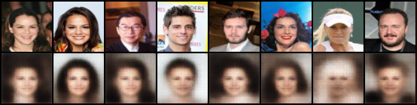
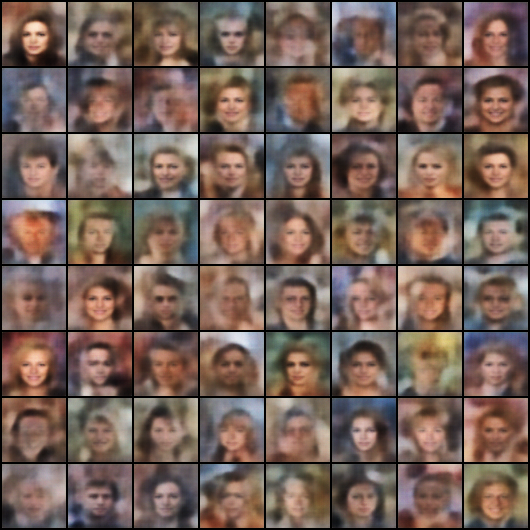
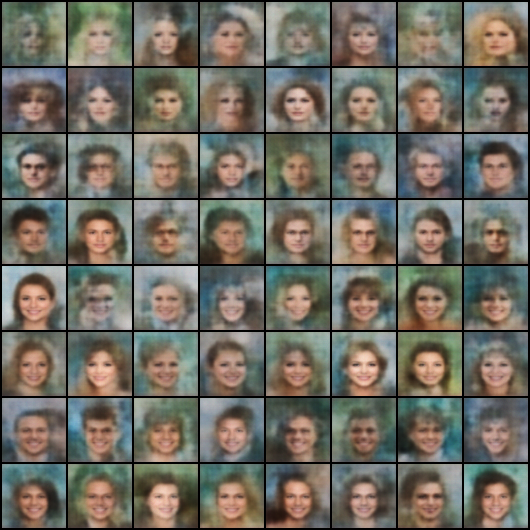

# Resultats disponibles - CelebA VAE / CVAE

Ce fichier resume les poids disponibles pour l'integration MLflow et la demo.

## Statut

Les runs Colab avec le protocole ameliore sont disponibles et ont ete deposes
dans les chemins attendus par l'application.

Ils utilisent bien :

- 32 000 images d'entrainement ;
- 3 000 images de validation ;
- 3 000 images de test ;
- `sampling_strategy: balanced_conditions` ;
- `latent_dim=128`, `hidden_channels=64` ;
- `beta=0.5` avec KL annealing ;
- early stopping avec `patience=10`, demarre apres l'epoch 20.

Ils ne sont pas alles jusqu'a 100 epochs : l'early stopping les a arretes a
l'epoch 30. Ce sont donc les poids Colab actuels a integrer dans la demo, mais
ils pourront etre remplaces plus tard par de meilleurs runs.

## Checkpoints a enregistrer

Les deux checkpoints principaux sont prets ici :

```text
projects/blaise_celeba/results/experiments/vae_improved/best_checkpoint.pth
projects/blaise_celeba/results/experiments/cvae_improved/best_checkpoint.pth
```

Les checkpoints ont ete normalises pour la demo :

- cle `configuration` presente ;
- `configuration.model.type` renseigne (`vae` ou `cvae`) ;
- `configuration.dataset.attributes` renseigne ;
- `configuration.training.beta` renseigne.

## Resultats validation

| Modele | Best epoch | Last epoch | Loss val best | Reconstruction val best | KL val best | Beta best |
|---|---:|---:|---:|---:|---:|---:|
| VAE | 4 | 30 | 752.04 | 661.03 | 455.07 | 0.20 |
| CVAE | 3 | 30 | 600.99 | 512.78 | 588.07 | 0.15 |

Note : les meilleurs checkpoints ont ete trouves pendant le warmup KL. Le run
a quand meme continue jusqu'a l'epoch 30 grace au demarrage retarde de l'early
stopping.

## Resultats test

Ces valeurs viennent de `projects/blaise_celeba/results/experiments/comparison.json`.

| Modele | Reconstruction test | KL test | Nombre images test |
|---|---:|---:|---:|
| VAE | 650.45 | 376.39 | 3 000 |
| CVAE | 664.25 | 218919.49 | 3 000 |

La KL test du CVAE est tres elevee sur le dernier etat evalue. Pour la demo,
il faut utiliser `best_checkpoint.pth`, pas `last_checkpoint.pth`.

## Ablation beta

Les checkpoints d'ablation fine restent disponibles :

```text
projects/blaise_celeba/results/experiments/ablation_beta_fine/beta_0.05/best_checkpoint.pth
projects/blaise_celeba/results/experiments/ablation_beta_fine/beta_0.1/best_checkpoint.pth
projects/blaise_celeba/results/experiments/ablation_beta_fine/beta_0.25/best_checkpoint.pth
projects/blaise_celeba/results/experiments/ablation_beta_fine/beta_0.5/best_checkpoint.pth
projects/blaise_celeba/results/experiments/ablation_beta_fine/beta_0.75/best_checkpoint.pth
projects/blaise_celeba/results/experiments/ablation_beta_fine/beta_1.0/best_checkpoint.pth
projects/blaise_celeba/results/experiments/ablation_beta_fine/beta_1.5/best_checkpoint.pth
projects/blaise_celeba/results/experiments/ablation_beta_fine/beta_2.0/best_checkpoint.pth
```

## Images disponibles

### Reconstructions VAE



### Echantillons aleatoires VAE



### Grille conditionnelle CVAE



## Message court pour la demo

Les poids CelebA Colab sont disponibles dans `results/experiments`. Les deux
modeles principaux `vae_improved` et `cvae_improved` utilisent le protocole
32k images equilibrees et peuvent etre enregistres dans MLflow avec
`make register`. Les runs se sont arretes a l'epoch 30 par early stopping ;
ils sont utilisables pour la demo, mais restent remplacables par de futurs
runs plus qualitatifs.
