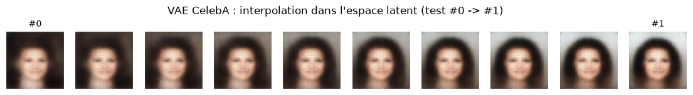
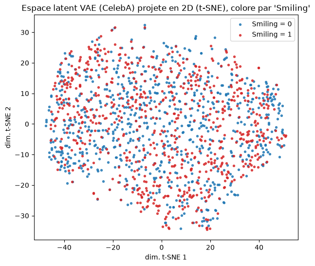
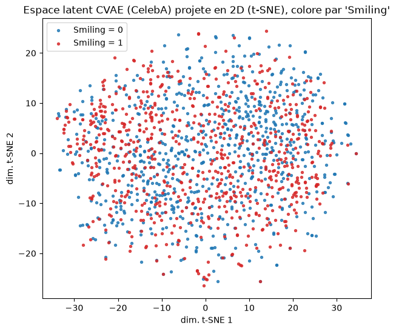
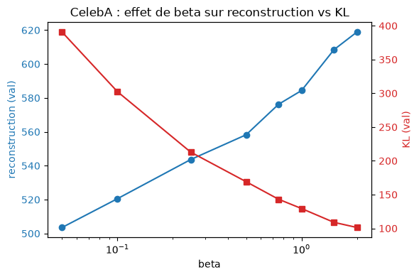

# Resultats provisoires - VAE / CVAE CelebA

Ce fichier resume les resultats disponibles actuellement pour preparer le PowerPoint.

Important : ces resultats correspondent aux anciens entrainements avec 8 000 images et 80 epoques maximum. Ils ne correspondent pas encore au nouveau protocole ameliore avec 32 000 images, sampling equilibre et 100 epoques. Ils seront donc remplaces quand les nouveaux entrainements seront termines.

## Protocole utilise

| Element | Valeur |
|---|---|
| Dataset | CelebA avec attributs |
| Images train | 8 000 |
| Images validation | 1 500 |
| Images test | 1 500 |
| Sampling | Naturel, non equilibre |
| Attributs CVAE | Smiling, Male, Wavy_Hair |
| Latent dim | 128 |
| Hidden channels | 64 |
| Beta final | 0.5 |
| Epochs max | 80 |
| Early stopping | Oui, patience 10 |
| Tracking | MLflow |

## Runs MLflow

| Modele | Run MLflow | Statut |
|---|---|---|
| VAE | `a277e9d3d1964674ab78bca9b823917f` | Termine avec early stopping |
| CVAE | `9f36aee1d9fc45a393b01ae1d340f3a1` | Termine avec early stopping |

Chemins des artefacts :

```text
projects/blaise_celeba/mlruns/1/a277e9d3d1964674ab78bca9b823917f/artifacts/
projects/blaise_celeba/mlruns/1/9f36aee1d9fc45a393b01ae1d340f3a1/artifacts/
```

## Resultats de validation

| Modele | Meilleure epoque | Derniere epoque | Loss val best | Reconstruction val best | KL val best | Beta |
|---|---:|---:|---:|---:|---:|---:|
| VAE | 64 | 73 | 468.58 | 367.15 | 202.88 | 0.5 |
| CVAE | 40 | 50 | 692.78 | 565.01 | 255.54 | 0.5 |

Lecture :

- Le VAE obtient une meilleure loss de validation que le CVAE sur ce run.
- Le CVAE ajoute une contrainte de conditionnement par attributs, ce qui rend la tache plus difficile.
- Les deux entrainements se sont arretes avant 80 epoques grace a l'early stopping.
- Les resultats sont utiles pour presenter l'approche, mais pas encore definitifs.

## Resultats de test disponibles

Ces valeurs viennent de `results/experiments/comparison.json`.

| Modele | Reconstruction test | KL test | Nombre images test |
|---|---:|---:|---:|
| VAE | 1141.46 | 954.55 | 1 500 |
| CVAE | 570.31 | 254.01 | 1 500 |

Pour le CVAE, une evaluation de controlabilite est aussi disponible :

| Attribut | Accuracy |
|---|---:|
| Smiling | 69.50% |
| Male | 54.87% |
| Wavy_Hair | 61.37% |
| Accuracy globale | 61.92% |

Interpretation pour la presentation :

- Le VAE sert de baseline generative non conditionnelle.
- Le CVAE permet de guider la generation avec des attributs.
- La controlabilite du CVAE est visible mais encore perfectible, surtout pour `Male`.
- Le prochain protocole devrait ameliorer la robustesse avec plus d'images, un sampling equilibre et 100 epoques maximum.

## Images disponibles

### Reconstructions VAE


Fichier : `results/figures/vae_reconstruction_grid.png`

### Echantillons aleatoires VAE


Fichier : `results/figures/vae_random_samples_grid.png`

### Grille conditionnelle CVAE


Fichier : `results/figures/cvae_grid.png`

### Interpolation dans l'espace latent



Fichier : `results/figures/interpolation_vae_0_to_1.png`

### Visualisation t-SNE du latent VAE



Fichier : `results/figures/latent_tsne_vae.png`

### Visualisation t-SNE du latent CVAE



Fichier : `results/figures/latent_tsne_cvae.png`

### Ablation beta



Fichier : `results/figures/ablation_beta_curve.png`

## Message court pour le PowerPoint

Nous avons entraine un VAE et un CVAE sur CelebA avec 8 000 images d'entrainement. Le VAE apprend a reconstruire et generer des visages sans condition, tandis que le CVAE ajoute un controle par attributs comme le sourire, le genre et les cheveux ondules. Les resultats provisoires montrent que le VAE obtient une meilleure loss de validation, tandis que le CVAE apporte une capacite de generation conditionnelle avec une accuracy globale de controlabilite d'environ 61.9%. Ces resultats seront remplaces par le nouveau protocole avec plus d'images, sampling equilibre et 100 epoques maximum.

